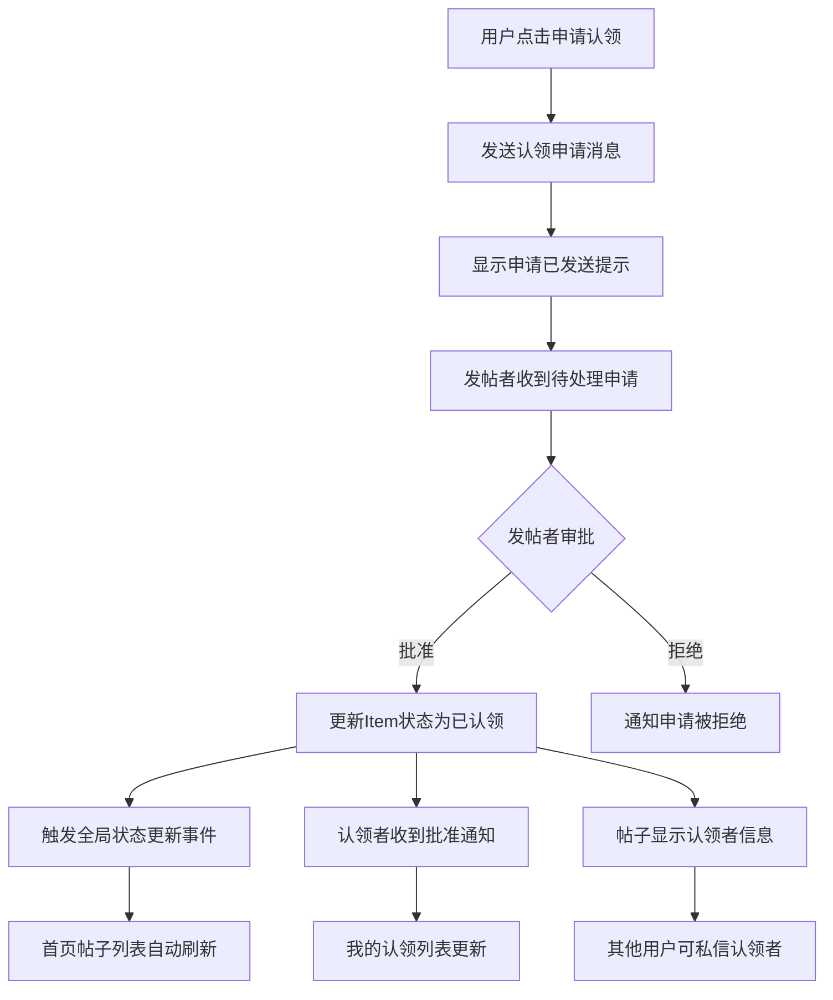

# 认领功能修复说明

## 🔧 **修复的问题**

### 1. **系统冲突问题**
- **问题**: 存在两套认领系统并存（直接认领API + 申请认领系统）
- **修复**: 移除了直接认领API，统一使用申请-审批流程
- **文件**: 
  - `backend/routes/item.py` - 移除了 `/items/<id>/claim` 路由
  - `backend/controllers/itemController.py` - 移除了 `claim_item` 函数
  - `Frontend/src/api/items.js` - 移除了 `claimItem` 函数

### 2. **前端事件处理错误**
- **问题**: `PostDetail` 组件发送认领申请后错误触发了 `@claim` 事件
- **修复**: 移除了错误的事件触发，只显示申请发送成功提示
- **文件**: 
  - `Frontend/src/components/PostDetail.vue` - 修改了 `onClaim` 函数
  - `Frontend/src/views/Home.vue` - 移除了 `@claim` 事件监听

### 3. **状态更新时机错误**
- **问题**: 认领申请发送后立即刷新帖子列表，但状态未改变
- **修复**: 只在认领申请被批准时才触发状态更新
- **文件**: 
  - `Frontend/src/views/Messages.vue` - 添加了认领批准事件触发
  - `Frontend/src/views/Home.vue` - 添加了 `claim-status-updated` 事件监听

### 4. **认领者信息显示不完整**
- **问题**: 后端只返回认领者ID，前端无法显示认领者详细信息
- **修复**: 后端返回完整的认领者信息，前端添加认领者信息显示
- **文件**: 
  - `backend/models/Item.py` - 修改了 `to_json` 方法返回完整认领者信息
  - `Frontend/src/components/PostDetail.vue` - 添加了认领者信息显示和交互

## 🎯 **修复后的认领流程**

## ✅ **验证步骤**

### 测试认领申请流程

1. **发送认领申请**
   - 登录用户A，浏览招领帖子
   - 点击"申请认领"按钮
   - 填写认领理由（至少10字符）
   - 确认发送申请
   - 验证：显示"认领申请已发送"提示

2. **处理认领申请**
   - 登录发帖者账户
   - 进入"我的消息" -> "待处理帖子"
   - 查看认领申请详情
   - 点击"批准"或"拒绝"
   - 验证：申请状态更新

3. **验证状态同步**
   - 在首页验证帖子状态是否自动更新为"已认领"
   - 验证帖子是否移至底部
   - 验证是否显示认领者信息

4. **验证认领者信息显示**
   - 查看已认领的帖子详情
   - 验证是否显示认领者头像和姓名
   - 点击认领者信息验证是否能发送私信

5. **验证我的认领列表**
   - 登录认领者账户
   - 进入个人中心 -> "我的认领"
   - 验证认领的物品是否正确显示

## 🚀 **新增功能**

1. **认领者信息展示**
   - 在已认领帖子中显示认领者头像和姓名
   - 支持点击认领者信息发送私信
   - 添加"可私信联系"提示

2. **智能状态更新**
   - 认领申请被批准时自动更新所有相关页面
   - 使用事件总线实现组件间通信
   - 避免不必要的数据刷新

3. **完整的审批流程**
   - 统一的申请-审批-通知流程
   - 状态同步机制
   - 用户友好的提示信息

## 📝 **注意事项**

1. 认领申请需要至少10个字符的说明
2. 用户不能认领自己发布的物品
3. 每个用户对同一物品只能发送一次认领申请
4. 已认领的物品不能再次申请认领
5. 认领者信息只在物品被认领后显示

## 🔍 **排错指南**

如果遇到问题，请检查：

1. **前端控制台**是否有JavaScript错误
2. **后端日志**是否有API调用错误  
3. **数据库**中Item的is_claimed和claimed_by字段是否正确更新
4. **浏览器**是否已清除缓存

## 🎉 **修复完成**

现在认领功能应该能正常按照您的预期工作：
- ✅ 申请认领 -> 发帖者审批 -> 状态更新
- ✅ 已认领帖子显示在列表底部
- ✅ 显示认领者信息供其他人私信联系
- ✅ 我的认领列表正常显示
- ✅ 数据状态实时同步 